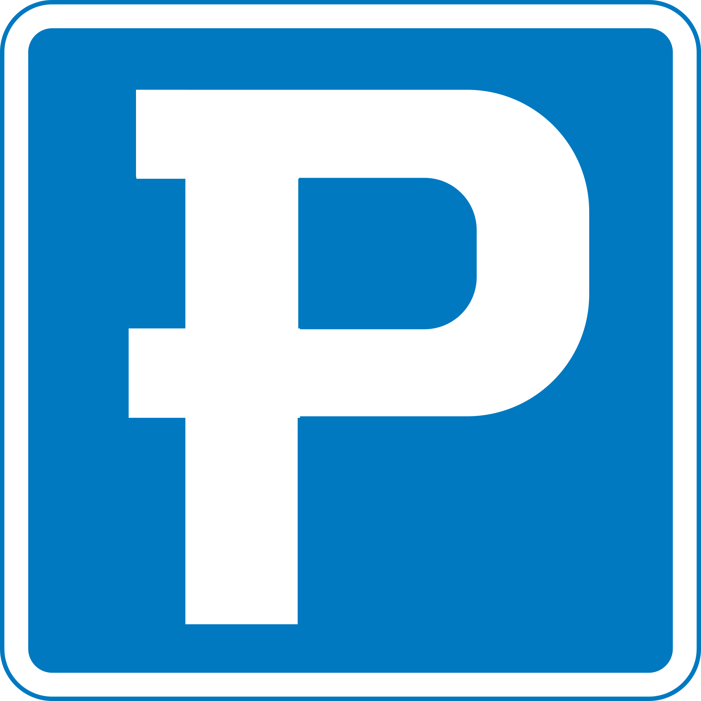

# Audi Kreathon18 - Team P.I.D.



The source code for team Parkid at Audi Kreathon 2018


## Dependencies:

npm: express, socket.io, johnny-fave, serialport
Arduino: arduinojson

## Demo v1 - 1 parkspace detected with Johnny-five:

Arduino: standart Firmata

## Demo v2 - 1 parkspace detected with Serialport:

Arduino: park_test_serial

## Demo v3 - 2 parkspace detected with Serialport:

Arduino: park_test_serial

## Demo v4 - Workflow demo without interface

Arduino: park_test_serial
Format:

```json
{
  "carID": "FF FF FF FF",
  "occupied": [
    0,
    ......,
    0
  ],
  "check": 0,
  "check_car": 0
}
```

## Demo v5 - workflow with interface

Arduino: park_test_serial
