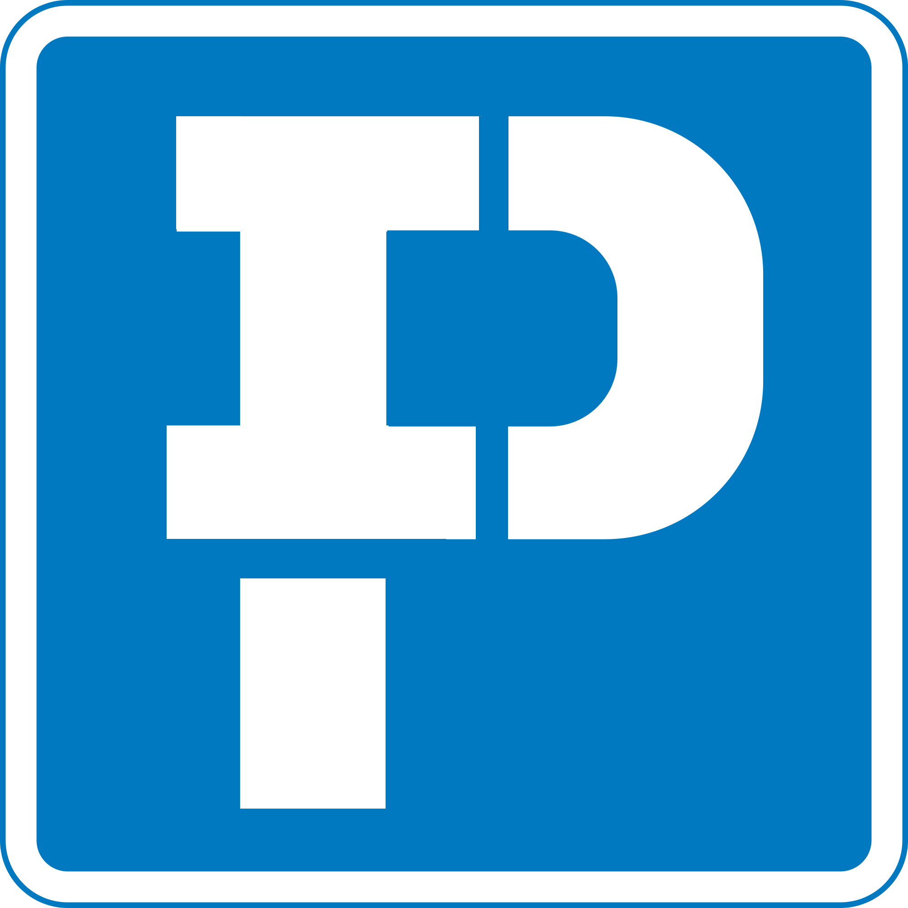
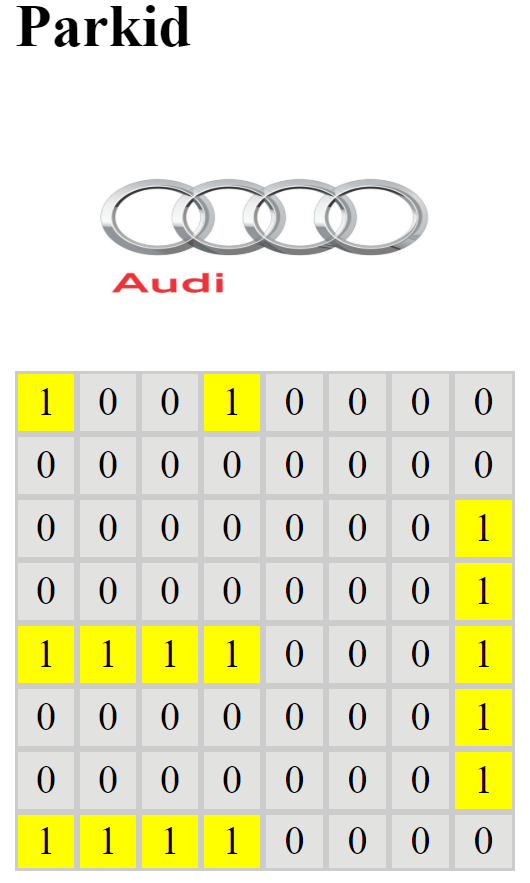

# Audi Kreathon18 - Team P.I.D.



The source code for team Parkid at Audi Kreathon 2018. We aim to develope a cloud based parking management service for the special parking space AAZ in an Audi production site. There are special function for these parking spaces(e.g. lift, measuring equipment...etc.).

**Problem Stetement:**
The traditional regisration for a parking space take hours to complete due to the manually process.

**The Solution we offered:**
A cloud based parking system with web app, mobile app and database support. An user can register a parking space with a carID(an RFID tag available on every production car) and desired function. When the car reaches the parking lot. The carID will be read and parking space is assigned by the system based on the funtion and availability. The system have sensors on each parking space which will check which space the driver parked and if the driver parked on a correct space. The information will be saved. The system can also locate one car's location when any colleague wants to retreive it. This repo contains the prototype that we had designed and developed in 96 hours during the Kreathon.



## Dependencies:

npm: express, socket.io, johnny-fave, serialport, mongoose
Arduino: arduinojson

## Demo v1 - 1 parkspace detected with Johnny-five:

Arduino: standart Firmata

## Demo v2 - 1 parkspace detected with Serialport:

Arduino: park_test_serial

## Demo v3 - 2 parkspace detected with Serialport:

Arduino: park_test_serial

## Demo v4 - Workflow demo without interface

Arduino: park_test_serial
Format:

```json
{
  "carID": "FF FF FF FF",
  "occupied": [
    0,
    ......,
    0
  ],
  "check": 0,
  "check_car": 0
}
```

## Demo v5 - workflow with interface

Arduino: park_test_serial
